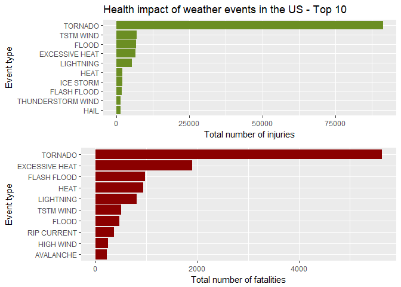
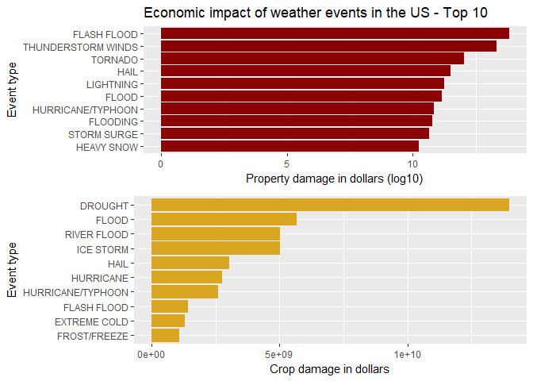

1: Synopsis
-----------

The goal is to explore the [NOAA Storm Database](https://www.ncdc.noaa.gov/stormevents/) and answer questions about severe weather events the effects of severe weather events on both population and economy. The database covers the time period between 1950 and November 2011.

### 1.1 Data Analysis

The following analysis investigates which types of severe weather events (EVTYPE variable) across the U.S. are most harmful to:

1.  Population Health
2.  Greatest Economic Consequences

2: Data Processing
------------------

Source Data: [Storm Data](https://d396qusza40orc.cloudfront.net/repdata%2Fdata%2FStormData.csv.bz2) National Weather Service [Storm Data Documentation](https://d396qusza40orc.cloudfront.net/repdata%2Fpeer2_doc%2Fpd01016005curr.pdf) National Climatic Data Center Stsorm Events [FAQ](https://d396qusza40orc.cloudfront.net/repdata%2Fpeer2_doc%2FNCDC%20Storm%20Events-FAQ%20Page.pdf)

### 2.1: Data Loading

Download the raw data file and extract the data into a dataframe, then convert to a data.table

``` r
library("data.table")
library("ggplot2")
```

    ## Warning: package 'ggplot2' was built under R version 3.4.2

``` r
library("plyr")
```

    ## Warning: package 'plyr' was built under R version 3.4.2

``` r
library("gridExtra")
```

    ## Warning: package 'gridExtra' was built under R version 3.4.3

``` r
library("grid")

fileUrl <- "https://d396qusza40orc.cloudfront.net/repdata%2Fdata%2FStormData.csv.bz2"
download.file(fileUrl, destfile = paste0(getwd(), '/repdata%2Fdata%2FStormData.csv.bz2'))
data <- read.csv(bzfile("repdata%2Fdata%2FStormData.csv.bz2"))
stormData <- as.data.table(data)
```

### 2.2: Data Subsetting

The analysis focuses only on the health and economic consequences of severe weather events so we subset to reduce the size of the dataset.

``` r
# Subsetting the data
stormDR <- stormData[,c("EVTYPE", "FATALITIES", "INJURIES", "PROPDMG","PROPDMGEXP","CROPDMG","CROPDMGEXP")]
```

### 2.3 Population Health

Fatalities and injuries are summarized according to event type, and ordered in decreasing value.

``` r
harmToHealth <- ddply(stormDR, .(EVTYPE), summarize,fatalities = sum(FATALITIES),injuries = sum(INJURIES))
fatal <- harmToHealth[order(harmToHealth$fatalities, decreasing = T), ]
injury <- harmToHealth[order(harmToHealth$injuries, decreasing = T), ]
```

### 2.3: Economic Consequences

Exponential data is stored in separate columns with letter values, so we ,need to convert the letters to numbers.

``` r
getExp <- function(e) {
    if (e %in% c("h", "H"))
        return(2)
    else if (e %in% c("k", "K"))
        return(3)
    else if (e %in% c("m", "M"))
        return(6)
    else if (e %in% c("b", "B"))
        return(9)
    else if (!is.na(as.numeric(e))) 
        return(as.numeric(e))
    else if (e %in% c("", "-", "?", "+"))
        return(0)
    else {
        stop("Invalid value.")
    }
}
```

Now property and crop damages are calculated.

``` r
propExp <- sapply(stormDR$PROPDMGEXP, FUN=getExp)
stormDR$propDamage <- stormDR$PROPDMG * (10 ** propExp)
cropExp <- sapply(stormDR$CROPDMGEXP, FUN=getExp)
stormDR$cropDamage <- stormDR$CROPDMG * (10 ** cropExp)
```

We summarize the damages for crops and property by event type by excluding the events which did not cause finalcial impact.

``` r
economicDamage <- ddply(stormDR, .(EVTYPE), summarize,propDamage = sum(propDamage), cropDamage = sum(cropDamage))
economicDamage <- economicDamage[(economicDamage$propDamage > 0 | economicDamage$cropDamage > 0), ]
```

Econommic data is sorted.

``` r
propDmgSorted <- economicDamage[order(economicDamage$propDamage, decreasing = TRUE), ]
cropDmgSorted <- economicDamage[order(economicDamage$cropDamage, decreasing = TRUE), ]
```

3: Results
----------

### 3.1: Events that are Most Harmful to Population Health

Calculating and showing top 5 total injuries and fatalities.

``` r
head(injury[, c("EVTYPE", "injuries")],5)
```

    ##             EVTYPE injuries
    ## 834        TORNADO    91346
    ## 856      TSTM WIND     6957
    ## 170          FLOOD     6789
    ## 130 EXCESSIVE HEAT     6525
    ## 464      LIGHTNING     5230

``` r
head(fatal[, c("EVTYPE", "fatalities")],5)
```

    ##             EVTYPE fatalities
    ## 834        TORNADO       5633
    ## 130 EXCESSIVE HEAT       1903
    ## 153    FLASH FLOOD        978
    ## 275           HEAT        937
    ## 464      LIGHTNING        816

It's apparent from the header results that TORNADOs generated the most injuries and fatalities.

Plotting the top 10 results for greater clarity.

``` r
p1 <- ggplot(data=head(injury,10), aes(x=reorder(EVTYPE, injuries), y=injuries)) +
   geom_bar(fill="olivedrab",stat="identity")  + coord_flip() + 
    ylab("Total number of injuries") + xlab("Event type") +
    ggtitle("Health impact of weather events in the US - Top 10") +
    theme(legend.position="none")

p2 <- ggplot(data=head(fatal,10), aes(x=reorder(EVTYPE, fatalities), y=fatalities)) +
    geom_bar(fill="red4",stat="identity") + coord_flip() +
    ylab("Total number of fatalities") + xlab("Event type") +
    theme(legend.position="none")

grid.arrange(p1, p2, nrow =2)
```



### 3.2: Events that have the Greatest Economic Consequences

Calculating and showing the top 5 events for ecomomic damages.

``` r
head(propDmgSorted[, c("EVTYPE", "propDamage")], 5)
```

    ##                 EVTYPE   propDamage
    ## 153        FLASH FLOOD 6.820237e+13
    ## 786 THUNDERSTORM WINDS 2.086532e+13
    ## 834            TORNADO 1.078951e+12
    ## 244               HAIL 3.157558e+11
    ## 464          LIGHTNING 1.729433e+11

``` r
head(cropDmgSorted[, c("EVTYPE", "cropDamage")], 5)
```

    ##          EVTYPE  cropDamage
    ## 95      DROUGHT 13972566000
    ## 170       FLOOD  5661968450
    ## 590 RIVER FLOOD  5029459000
    ## 427   ICE STORM  5022113500
    ## 244        HAIL  3025974480

Plotting the top 10 results for greater clarity.

``` r
p3 <- ggplot(data=head(propDmgSorted,10), aes(x=reorder(EVTYPE, propDamage), y=log10(propDamage), fill=propDamage )) +
    geom_bar(fill="darkred", stat="identity") + coord_flip() +
    xlab("Event type") + ylab("Property damage in dollars (log10)") +
    ggtitle("Economic impact of weather events in the US - Top 10") +
    theme(plot.title = element_text(hjust = 0))

p4 <- ggplot(data=head(cropDmgSorted,10), aes(x=reorder(EVTYPE, cropDamage), y=cropDamage, fill=cropDamage)) +
    geom_bar(fill="goldenrod", stat="identity") + coord_flip() + 
    xlab("Event type") + ylab("Crop damage in dollars") + 
    theme(legend.position="none")

grid.arrange(p3, p4, ncol=1, nrow =2)
```


